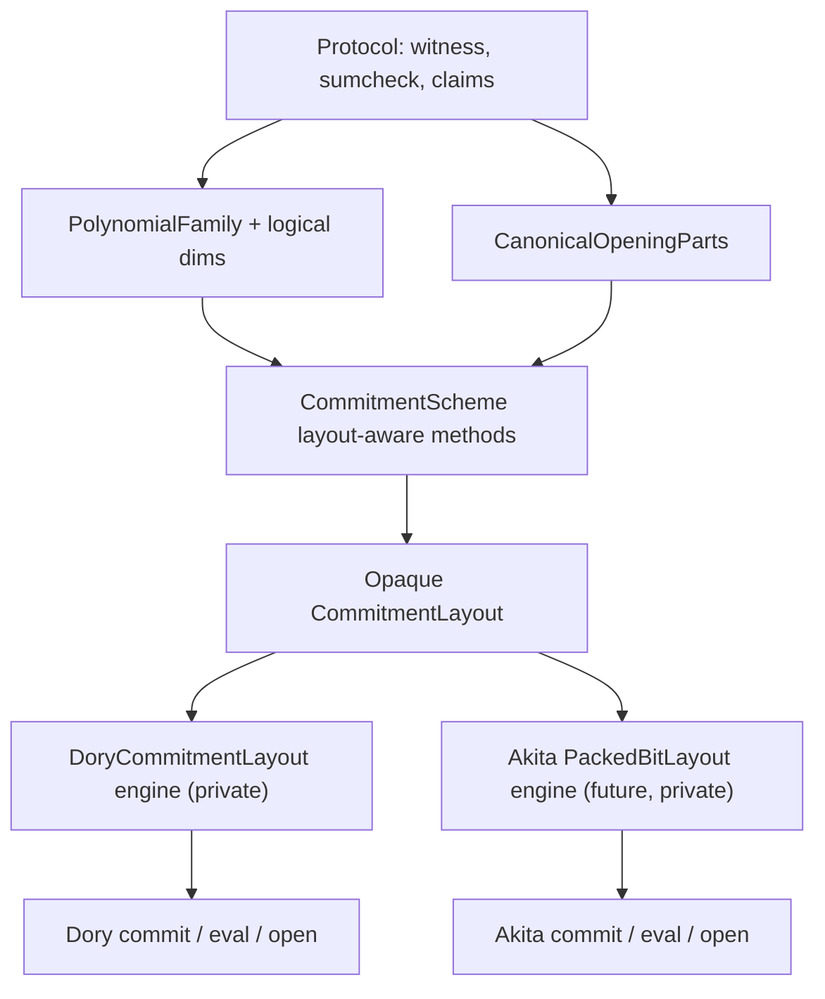
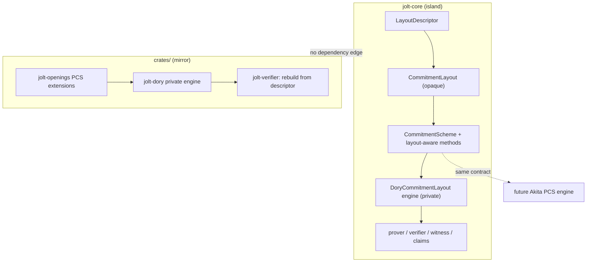

# Spec: Commitment Layout Abstraction (remove DoryGlobals, de-bake matrix shape and trace order)

| Field       | Value                          |
|-------------|--------------------------------|
| Author(s)   | @quangvdao                     |
| Created     | 2026-06-15                     |
| Status      | draft                          |
| PR          |                                |

> **Draft notice:** This spec is a working draft. Details may be incorrect, incomplete, or require revision after further investigation. Do not treat it as approved or implementation-ready without explicit review.

## Summary

Jolt's commitment geometry is hardcoded in two ways that block a future ring/lattice PCS (Akita) from slotting in without re-forking the prover.
First, the commitment "shape" is always a balanced 2D matrix parametrized only by `(sigma, nu)` = (column vars, row vars).
Second, the coefficient "trace order" is a closed 2-variant enum, cycle-major or address-major (`DoryLayout`).
Both assumptions are wired into `jolt-core` through the thread-local global `DoryGlobals`, which the prover, verifier, witness polynomials, and every claim reduction read implicitly.

This spec replaces `DoryGlobals` with an **opaque PCS-owned layout plan** threaded explicitly through the prover and verifier.
The shared contract is small: a serializable `LayoutDescriptor`, a `CommitmentLayout` associated type that carries no operational geometry in its public surface, and **PCS-level methods** that accept logical polynomial families and canonical opening-point parts.
Dory keeps all matrix shape, embedding, stride, and orientation logic inside a private `DoryCommitmentLayout` engine; Akita will do the same with its packed layout engine.
Akita integrates into `jolt-core` first, so `jolt-core` is the primary target: `DoryGlobals` is removed entirely, not wrapped.
`jolt-core` remains a dependency island (no new edges to `jolt-poly` / `jolt-claims` / `jolt-openings`); the abstraction is defined inside `jolt-core`, and the modular crates mirror the same contract in parallel.

## Intent

### Goal

Delete `DoryGlobals` from `jolt-core` by introducing an opaque PCS-owned layout plan and extending `CommitmentScheme` with layout-aware operations.
Protocol code (witness generation, claim reductions, stage-8 opening) passes **logical polynomial families** and **canonical opening-point parts** into PCS methods; it never reads rows, columns, strides, orientation, or physical coefficient placement.

The abstraction introduces or modifies these boundaries:

- `LayoutDescriptor` (new, `jolt-core/src/poly/commitment/`): Fiat-Shamir-bindable public identity of a layout plan. Scheme-defined payload; not a dump of operational geometry.
- `CommitmentLayout` (new associated type on `CommitmentScheme`): opaque, `Clone` PCS-owned value constructed once at preprocessing/prove time. Public surface is descriptor serialization/validation and setup-sizing metadata only. No `flat_index`, `chunk_len`, `sigma`, `nu`, or cycle/address-major on the trait.
- `CommitmentScheme` layout-aware extensions (new methods on the existing trait): commit, open, evaluate, stream, and final-opening-point translation take `&Self::CommitmentLayout` plus **logical inputs** (`PolynomialFamily`, `CanonicalOpeningParts`). The PCS dispatches into its private engine.
- `DoryCommitmentLayout` (new, private to `jolt-core/src/poly/commitment/dory/`): Dory's layout **engine**. Owns today's `DoryGlobals` semantics (orientation, balanced matrix shape, embedded T, main log embedding, strides, square/almost-square policy, context kind). All current `get_*` / `initialize_*` helpers become private inherent methods here; nothing outside the Dory module calls them.
- Explicit layout values: `DoryContext::{Main, TrustedAdvice, UntrustedAdvice}` becomes three explicit `DoryCommitmentLayout` values stored on the prover/preprocessing and passed by reference. No global context switch.
- Generalized wire descriptor: `JoltProof`'s `dory_layout: DoryLayout` (a `u8`) becomes `LayoutDescriptor`. Wire format change is in scope.
- Modular mirror (**fast-follow PR, not this one**): same opaque-layout + PCS-engine contract in `crates/jolt-openings` / `jolt-dory`. No code shared across the island boundary.

This spec covers **one PR**: the `jolt-core` centerpiece (slices 1-9). Slice 10 is the immediate fast-follow modular mirror.

The end state: protocol code depends on PCS methods and logical families, never on `DoryLayout`, `balanced_sigma_nu`, `DoryGlobals`, or physical placement helpers. Adding Akita is "implement the PCS engine for Akita," not "edit the prover to learn packed-bit geometry."

### Invariants

- **Dory behavior is bit-identical.** For every guest program and both feature modes, proof bytes, Fiat-Shamir challenges, and verification outcome must equal the pre-refactor outputs for the default Dory layout (cycle-major, balanced 2D). `soundness` and `transcript_symmetry` are the guard.
- **Prover/verifier layout agreement.** The verifier reconstructs the exact layout plan the prover used from `LayoutDescriptor` and binds it into the transcript before any layout-dependent challenge. Descriptor mismatch is a Fiat-Shamir failure.
- **No global commitment state in `jolt-core`.** No `static`/thread-local Dory parameters. `rg DoryGlobals jolt-core/` is empty after the change.
- **Opaque layout, inverted control.** Non-Dory modules do not call physical placement helpers (`flat_index`, `get_num_columns`, `one_hot_stride`, orientation matches, etc.). They pass `PolynomialFamily` + logical dimensions (or `CanonicalOpeningParts`) into `CommitmentScheme` methods; the PCS engine performs placement internally. Verified structurally: an Akita sketch with private `PackedBitLayout` compiles by implementing the PCS engine, not by widening the shared trait.
- **Hot paths stay monomorphized.** No `dyn CommitmentLayout`. PCS methods monomorphize over `PCS::CommitmentLayout`; Dory's cycle-major fast paths remain distinct code paths inside the Dory engine, not a general per-coefficient formula on the trait.
- **Layout is fixed before opening.** Determined at commit/preprocess time and serialized; not discovered from the final opening batch.
- **Three advice contexts remain distinct.** Main, trusted-advice, and untrusted-advice retain separate layout values; no context leakage across commit or claim reduction.
- New `jolt-eval` invariant via `/new-invariant`: `commitment_layout_dory_parity` — commit/open/VMP/opening-point outputs via the new PCS-engine path equal pre-refactor `DoryGlobals` outputs on a representative trace.

### Non-Goals

- **Not implementing Akita.** This PR removes blockers; lattice PCS, `PackedBitLayout`, ring packing, and masked-view sumchecks land in a follow-up.
- **Not changing sumcheck protocol or claim algebra.** Round counts and claim formulas are unchanged. Claim reductions stop reading globals and instead call PCS layout-aware helpers with logical families.
- **Not crossing the island.** No new `jolt-core` dependency on modular crates.
- **Not the modular mirror in this PR.** Slice 10 is fast-follow.
- **Not generalizing N-dimensional placement in Dory.** Dory stays balanced 2D internally; the shared contract stays scheme-neutral.
- **Not the verifier/prover PCS trait split** from closed PR #1467.
- **Not resurrecting `BatchOpeningPoint { public, proof }`** from stale PR #1521.

## Evaluation

### Acceptance Criteria

- [ ] `DoryGlobals` (struct, statics, `DoryContext`, `DoryContextGuard`, `set_layout`, `initialize_*`, `get_*`) is deleted from `jolt-core`; `rg DoryGlobals jolt-core/` returns nothing.
- [ ] `LayoutDescriptor` exists; round-trip serialization (compress + uncompressed) and malformed-descriptor rejection tests pass.
- [ ] `CommitmentScheme` has `type CommitmentLayout`; the associated type's **public** surface exposes only descriptor + setup-sizing metadata (no physical geometry accessors).
- [ ] `CommitmentScheme` gains layout-aware methods (commit/open/evaluate/stream/final-opening translation) taking `&Self::CommitmentLayout` plus logical inputs; `DoryCommitmentScheme` implements them via private `DoryCommitmentLayout` engine methods.
- [ ] `DoryLayout`, `balanced_sigma_nu`, orientation, matrix shape, embedding, and stride helpers are **private to** `jolt-core/src/poly/commitment/dory/`; `rg 'DoryLayout|balanced_sigma_nu|one_hot_stride|dense_stride' jolt-core/src --glob '!**/dory/**'` returns nothing outside tests.
- [ ] Main / trusted-advice / untrusted-advice are three explicit layout values on the prover/preprocessing; no global context switch.
- [ ] `JoltProof` carries `LayoutDescriptor`; verifier reconstructs the layout, binds descriptor in `fiat_shamir_preamble`, and threads layout into stage-8 opening.
- [ ] `muldiv` e2e passes in both `--features host` and `--features host,zk`.
- [ ] `soundness` and both `transcript_symmetry` `jolt-eval` invariants pass.
- [ ] `commitment_layout_dory_parity` (or equivalent golden parity tests) confirms commit/open/VMP/opening-point outputs match the pre-refactor path for cycle-major and address-major, main and advice contexts, streaming and materialized commit paths.
- [ ] Structural check: an Akita `PackedBitLayout` sketch implements the PCS engine boundary (private layout + descriptor) without modifying the shared trait. `#[cfg(test)]` or doc example is sufficient.
- [ ] *(Fast-follow PR)* Modular mirror: same opaque-layout + PCS-engine contract in `jolt-openings` / `jolt-dory` / `jolt-verifier`.
- [ ] Clippy clean in both modes.
- [ ] No end-to-end prover-time regression beyond the Performance gate.

### Testing Strategy

Standard gate:

```bash
cargo fmt -q
cargo clippy --all --features host -q --all-targets -- -D warnings
cargo clippy --all --features host,zk -q --all-targets -- -D warnings
cargo nextest run -p jolt-core muldiv --cargo-quiet --features host
cargo nextest run -p jolt-core muldiv --cargo-quiet --features host,zk
```

Targeted tests:

- Port existing Dory layout tests (`jolt-core/src/poly/commitment/dory/tests.rs`) to exercise the **private** `DoryCommitmentLayout` engine, not globals.
- Commit/open/VMP parity: new PCS-engine path vs golden pre-refactor outputs for cycle/address-major, main/advice, streaming vs materialized.
- `LayoutDescriptor` round-trip and tamper rejection (transcript divergence when descriptor is swapped).
- Advice e2e tests (non-ZK advice polynomials; verifier reconstruction mismatches).
- Both `host` and `host,zk` for all of the above.
- Encapsulation lint: CI check or test that non-`dory/` modules do not import Dory physical-placement symbols.
- Extensibility: `PackedBitLayout` sketch compiles as a PCS engine impl without trait changes.

### Performance

Inner commit/VMP loops run across millions of coefficients; this refactor must be performance-neutral for Dory.

- **No more than 1% end-to-end prover-time regression** on `prover_time_fibonacci_100` and `prover_time_sha2_chain_100`, measured against the same base revision, machine, and feature set.
- No regression in Dory commit or witness-generation time; removing `RwLock`/`AtomicU8` reads from globals should be neutral-to-favorable.
- Peak RSS unchanged.

Candidate `/new-objective`: `dory_commit_time` and/or track `prover_time_*` as evidence if no new objective is added.

## Design

### Architecture

#### Principle: opaque plan, PCS engine, logical protocol surface

Complexity is not removed from Dory; it is **relocated** behind Dory's PCS implementation.
The shared contract stays thin so Akita can be equally complex internally without forcing Dory concepts into protocol code or Akita concepts into the trait.



Three concerns that today live in `DoryGlobals` (all **private to the PCS engine**, not on the shared trait):

```text
1. Trace embedding / order  : cycle-major vs address-major
2. Commit geometry          : balanced 2D matrix, square/almost-square policy
3. Opening-point permutation: protocol canonical parts -> scheme coordinate order
```

#### Shared contract (small, in `jolt-core/src/poly/commitment/`)

**`LayoutDescriptor`** — public wire identity, not an operational dump:

```rust
#[derive(Clone, PartialEq, Eq, CanonicalSerialize, CanonicalDeserialize)]
pub struct LayoutDescriptor {
    scheme_tag: u16,
    payload: Vec<u8>,   // scheme-defined; Dory: orientation byte + shape-policy id
}
```

Bound into Fiat-Shamir under `b"commitment_layout"`. Verifier reconstructs the opaque layout from descriptor + public proof metadata (trace length, one-hot config, program mode, advice presence) per scheme-defined rules documented on the Dory engine.

**`CommitmentLayout` associated type** — opaque plan, minimal public surface:

```rust
/// Opaque PCS-owned layout plan. Operational geometry lives in the PCS engine.
pub trait CommitmentLayout: Clone + Send + Sync + 'static {
    fn descriptor(&self) -> LayoutDescriptor;

    /// Validate a deserialized descriptor against public proof/preprocessing inputs.
    fn validate_descriptor(
        desc: &LayoutDescriptor,
        public: &LayoutPublicInputs,
    ) -> Result<Self, LayoutError>;

    /// Broad metadata for setup sizing (max vars across committed families).
    /// No row/column/chunk accessors.
    fn max_setup_vars(&self) -> usize;
}
```

No `flat_index`, `chunk_len`, `num_commit_chunks`, `reorder_opening_point`, or Dory-shaped coordinates on this trait.

**Logical inputs protocol code may pass** (scheme-neutral enums/structs in `jolt-core/src/poly/commitment/`):

```rust
/// Which committed polynomial family is being laid out.
pub enum PolynomialFamily {
    MainTraceOneHot,
    MainTraceDense,
    TrustedAdvice,
    UntrustedAdviceBytecodeChunk { chunk_idx: usize },
    UntrustedAdviceProgramImage,
    // extensible for Akita: PackedOneHot { poly_selector: usize }, etc.
}

/// Logical dimensions the protocol already knows (not physical matrix shape).
pub struct LogicalDimensions {
    pub log_k: usize,
    pub log_t: usize,
    pub main_log_embedding: Option<usize>,  // Main only; None for advice families
}

/// Canonical opening-point parts composed by sumcheck stages before PCS reorder.
pub struct CanonicalOpeningParts<F: JoltField> {
    pub r_cycle_stage6: Vec<F>,
    pub r_address_stage7: Vec<F>,
    pub precommitted_anchors: Vec<Vec<F>>,
    pub log_k_chunk: usize,
    pub log_t: usize,
}
```

**`CommitmentScheme` extensions** — where operational work happens:

```rust
pub trait CommitmentScheme: Clone + Sync + Send + 'static {
    type CommitmentLayout: CommitmentLayout;
    // ... existing associated types ...

    fn commit_with_layout(
        layout: &Self::CommitmentLayout,
        family: PolynomialFamily,
        dims: &LogicalDimensions,
        poly: &MultilinearPolynomial<Self::Field>,
        setup: &Self::ProverSetup,
    ) -> (Self::Commitment, Self::OpeningProofHint);

    fn evaluate_with_layout<F: JoltField>(
        layout: &Self::CommitmentLayout,
        family: PolynomialFamily,
        poly: &MultilinearPolynomial<F>,
        opening_point: &[F::Challenge],
    ) -> F;

    fn pcs_opening_point<F: JoltField>(
        layout: &Self::CommitmentLayout,
        canonical: &CanonicalOpeningParts<F>,
    ) -> Result<Vec<F::Challenge>, ProofVerifyError>;

    // StreamingCommitmentScheme: process_chunk_with_layout, aggregate_with_layout
}
```

Protocol modules call these methods. They do **not** branch on `DoryLayout` or read matrix dimensions.

`pcs_opening_point` subsumes today's `compute_final_opening_point` branching **and** Dory's PCS-endianness reverse (today in `commitment_scheme.rs:218-225`). Endianness stays inside the Dory PCS impl, not on the shared trait.

#### Dory private engine (`jolt-core/src/poly/commitment/dory/`)

`DoryCommitmentLayout` is the replacement for `DoryGlobals`. It may be internally rich; nothing outside `dory/` sees that richness.

```rust
// pub(crate) or private — NOT part of the shared CommitmentLayout trait surface
pub(crate) struct DoryCommitmentLayout {
    context: DoryContext,           // Main | TrustedAdvice | UntrustedAdvice
    orientation: DoryOrientation,   // private: CycleMajor | AddressMajor
    shape: DoryMatrixShape,         // private: num_rows, num_cols, sigma, nu
    embedding: DoryEmbedding,       // stored_t, embedded_t, main_log_embedding
}

impl DoryCommitmentLayout {
    // Private engine methods (migrated from DoryGlobals):
    // calculate_dimensions, one_hot_stride, dense_stride, cycle_row_len,
    // get_embedded_t, flat_index, commit_tier1_dispatch, vmp_dispatch, ...
}
```

Construction recipes (replace `initialize_*` globals):

| Context | Construction inputs (today's semantics) |
|---------|----------------------------------------|
| Main | `(k_chunk, trace_len, main_total_vars, orientation)` from `prover.rs:646-651` |
| TrustedAdvice | `advice_sigma_nu_from_max_bytes` + macro `(num_rows, num_cols)` |
| UntrustedAdvice bytecode | `(committed_lanes(), chunk_T)` per chunk |
| UntrustedAdvice program image | `(1, program_image_num_words)` |

Verifier two-phase init (stage-1 trace padding vs stage-6 `main_total_vars`) becomes explicit layout reconstruction from descriptor + public inputs, not re-entrant globals.

`DoryCommitmentScheme` implements `CommitmentScheme` layout-aware methods by dispatching on `PolynomialFamily` into `DoryCommitmentLayout` private engine code. `one_hot_polynomial.rs`, `rlc_polynomial.rs`, and `multilinear_polynomial.rs` stop reading globals; they call `evaluate_with_layout` / streaming helpers or move layout-specific eval into the Dory module.

#### Removing DoryGlobals: explicit threading

```text
Preprocessing / Prover construction
  -> build DoryCommitmentLayout for Main, TrustedAdvice, UntrustedAdvice
  -> store on prover + preprocessing

Witness gen / commit / VMP / claim reductions
  -> pass PolynomialFamily + LogicalDimensions + &DoryCommitmentLayout
  -> OR call PCS::commit_with_layout / evaluate_with_layout (layout threaded inside)

JoltProof
  -> LayoutDescriptor

Verifier
  -> CommitmentLayout::validate_descriptor(desc, public_inputs)
  -> bind descriptor in fiat_shamir_preamble
  -> PCS::pcs_opening_point for stage-8
```

~15 modules / ~70+ `DoryGlobals::` call sites in `jolt-core` invert control into PCS methods or Dory-private engine calls. Additional out-of-core touch points: `jolt-sdk` macro, `transpiler/symbolic_proof.rs`, `crates/jolt-verifier/compat/*` (compat updated in fast-follow or minimally for wire format).

#### Modular mirror (fast-follow PR)

Same design: opaque `CommitmentLayout` + PCS-engine methods in `jolt-openings`; `jolt-dory` private engine; `jolt-verifier` rebuilds from descriptor. `TracePolynomialOrder` / `CommitmentMatrixShape` in `jolt-claims` generalize to logical-family + PCS dispatch, not to a fat shared geometry trait.



### Alternatives Considered

- **Fat `CommitmentLayout` trait with `flat_index`, `chunk_len`, `reorder_opening_point`.** Rejected: widens the shared surface with Dory-shaped operations; every new Dory helper becomes trait pressure. Opaque plan + PCS methods invert control instead.
- **Shared `jolt-poly::layout` crate.** Rejected: breaks the `jolt-core` island.
- **Keep `DoryGlobals`, wrap behind trait.** Rejected: hidden global state remains; Akita would inherit the footgun.
- **Split `Geometry` + `Order` associated types on the trait.** Rejected for the shared contract; Dory may split privately inside its engine.
- **`dyn CommitmentLayout`.** Rejected: hot-path regression.
- **`BatchOpeningPoint { public, proof }`.** Rejected per maintainer feedback on PR #1521.
- **`natural_chunk_len()` only.** Rejected: under-generalizes for Akita N-dimensional packing.
- **Minimal geometry extraction without globals removal.** Rejected: superseded by full `DoryGlobals` deletion requirement.

## Documentation

Internal refactor; no `book/` change for Dory parity.
Module docs on `CommitmentLayout` state: opaque PCS plan, logical families at the protocol boundary, layout fixed before opening, operational geometry private to each PCS engine.

## Execution

Suggested slices (keep each green; `muldiv` both modes is the gate):

1. Define `LayoutDescriptor`, `PolynomialFamily`, `LogicalDimensions`, `CanonicalOpeningParts`, and opaque `CommitmentLayout` trait in `jolt-core`. Implement private `DoryCommitmentLayout` engine wrapping today's `DoryGlobals` logic (globals still present). Port `test_dory_layout_*` to engine unit tests.
2. Add `CommitmentScheme::CommitmentLayout` + layout-aware method signatures; implement on `DoryCommitmentScheme` by delegating to the private engine. Initially dual-path against still-present globals for parity.
3. Construct three explicit layout values at prover/preprocessing; cut witness gen and commit over to `commit_with_layout` / streaming-with-layout. Stop reading globals in `one_hot_polynomial.rs` / `rlc_polynomial.rs`.
4. Cut claim reductions and `bytecode/chunks.rs` over to PCS layout-aware evaluate/VMP helpers with `PolynomialFamily`.
5. Cut `compute_final_opening_point` and stage-8 opening over to `PCS::pcs_opening_point` with `CanonicalOpeningParts`.
6. Replace proof `dory_layout` + preamble with `LayoutDescriptor`; verifier `validate_descriptor` + reconstruction tests.
7. Delete `DoryGlobals`; `rg DoryGlobals jolt-core/` empty; full suite both modes.
8. Add `commitment_layout_dory_parity` invariant and Akita PCS-engine sketch test.
9. Benchmark `prover_time_fibonacci_100` / `prover_time_sha2_chain_100`; confirm <=1% gate.

Slice 10 (fast-follow): modular mirror in `jolt-openings` / `jolt-dory` / `jolt-verifier` / compat.

Keep `DoryCommitmentLayout` cheap to clone; `#[inline]` on engine hot paths inside the Dory module.

## References

- [`specs/proof-trace-row-layout.md`](./proof-trace-row-layout.md) — logical accessors over private layout, parity invariant, perf gate.
- [`specs/1344-committed-bytecode-program-image.md`](./1344-committed-bytecode-program-image.md), [`specs/jolt-verifier-model-crate.md`](./jolt-verifier-model-crate.md) — modular verifier geometry context.
- Prior art: PR #1467 (PCS trait split), PR #1521 (`natural_chunk_len` bet; dual-coordinate rejection), `quangvdao/quang/jolt-openings-core-integration-backup`.
- Akita evidence: `lz/integrate-akita:jolt-core/src/poly/commitment/akita/packed_layout.rs` (`PackedBitLayout`, `reorder_packed_point`, `locate` as **private engine**, not shared trait methods).
- Current geometry to relocate into Dory engine: `jolt-core/src/poly/commitment/dory/dory_globals.rs`, `poly/{one_hot_polynomial,rlc_polynomial,multilinear_polynomial}.rs`, `zkvm/mod.rs`, `zkvm/proof_serialization.rs`.
- Modular logical opening composition model: `crates/jolt-claims/src/protocols/jolt/formulas/committed_openings.rs` (`CanonicalOpeningParts`-shaped inputs, `TracePolynomialOrder` branching to become PCS dispatch).
- `jolt-eval` guards: `jolt-eval/src/invariant/{soundness,transcript_symmetry}.rs`.
