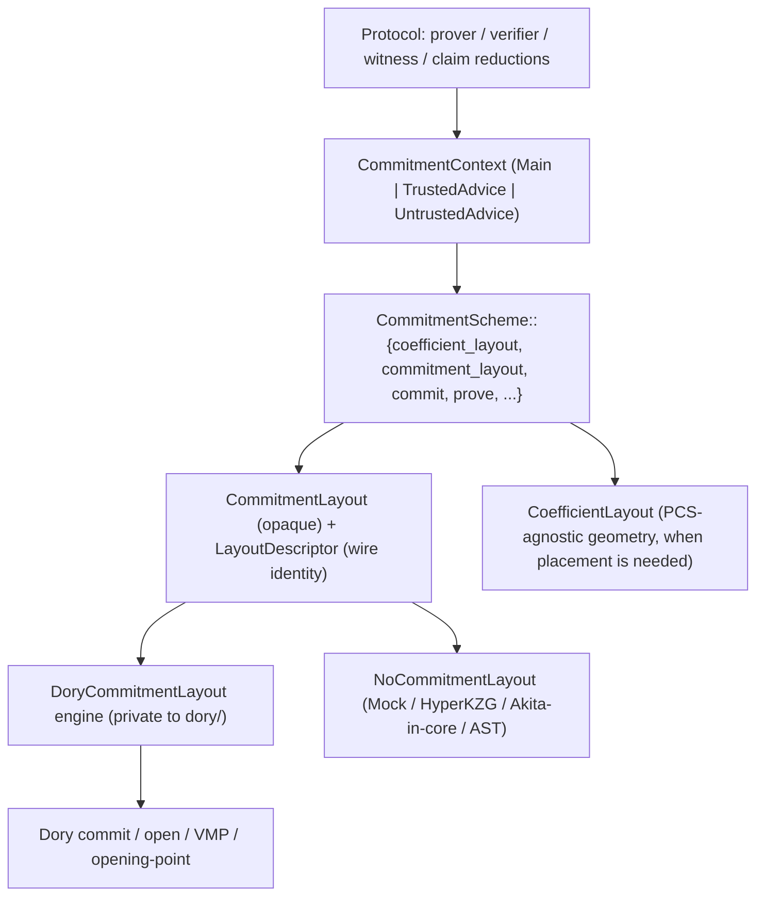

# Spec: Generic PCS in zkVM (explicit commitment layouts, prover/verifier decoupled from DoryGlobals)

| Field       | Value                          |
|-------------|--------------------------------|
| Author(s)   | @mtbadakhshan                  |
| Created     | 2026-06-16                     |
| Status      | proposed                       |
| PR          | [#23](https://github.com/LayerZero-Research/jolt/pull/23) |

> **Spec-of-record.** This documents the design *as actually implemented* on `taghi/refactor/generic-pcs-in-zkvm`. It supersedes the aspirational draft [`commitment-layout-abstraction.md`](./commitment-layout-abstraction.md); the portions of that draft not realized here are carried forward as explicit Non-Goals / follow-ups below.

## Summary

Jolt's commitment geometry used to be hardcoded around Dory and reached through a thread-local global, `DoryGlobals`: the matrix shape (balanced 2D `(sigma, nu)`), the trace orientation (cycle-major vs address-major), the dense/one-hot embedding strides, and the opening-point convention were all read implicitly by the prover, verifier, witness polynomials, and every claim reduction. This made the layout a hidden, ambient input — the orientation a proof was committed with was not authenticated, address-major was effectively unreachable through the public API (and its e2e tests were vacuous), and a second PCS (the ring/lattice scheme Akita) could not slot in without re-forking the prover.

This refactor makes the commitment layout an **explicit, PCS-owned value threaded through the prover and verifier** instead of ambient global state. It introduces a PCS-agnostic coefficient geometry (`CoefficientLayout`), an opaque, Fiat-Shamir-bindable layout identity (`LayoutDescriptor` + the `CommitmentLayout` trait), and a private Dory layout engine (`DoryCommitmentLayout`) that owns all of Dory's shape/orientation/stride logic. The `CommitmentScheme` trait gains a single, layout-taking commit/open API (no global reads, no method doubling), the prover carries an explicit `PCS` instance, and the proof carries a `LayoutDescriptor` that the verifier reconstructs and binds before any layout-dependent challenge. Cycle-major Dory behavior is bit-identical; address-major is now a first-class, authenticated layout selectable through the public API.

## Intent

### Goal

Replace ambient `DoryGlobals`-driven commitment geometry with an explicit, PCS-owned layout value threaded through commit, open, witness generation, claim reductions, the Fiat-Shamir preamble, and the serialized proof — so that the layout a proof uses is a single authenticated source of truth and a non-Dory PCS can be added by implementing the layout engine rather than editing protocol code.

Abstractions introduced or modified (all in `jolt-core/src/poly/commitment/`, plus consumers):

- **`CoefficientLayout`** (new, `poly/coefficient_layout.rs`): PCS-agnostic geometry for arranging 1D polynomial coefficients — `{ num_columns, num_rows, T, cycle_major }` with helpers (`address_cycle_to_index`, `cycles_per_row`, `one_hot_num_rows`). This is the geometry protocol code is allowed to see when it genuinely needs placement (advice binding-round math, bytecode chunking, RLC vector–matrix product) — replacing direct `DoryGlobals` reads.
- **`LayoutDescriptor`** (new, `poly/commitment/layout.rs`): `{ scheme_tag: u16, payload: Vec<u8> }`, `CanonicalSerialize`/`Deserialize`. The serializable public identity of a layout plan, bound into Fiat-Shamir. Dory's payload is a single orientation byte; layout-free schemes use the empty payload.
- **`CommitmentLayout` trait** (new): opaque PCS-owned layout plan with a minimal public surface — `descriptor()` and `validate_descriptor(descriptor, public: &LayoutPublicInputs)`. `NoCommitmentLayout` is the zero-information impl for schemes whose layout is fixed (Mock, HyperKZG, Akita-in-core, the transpiler AST scheme).
- **`CommitmentScheme` extensions** (modified trait): `type CommitmentLayout`; `coefficient_layout(config, context)`; `commitment_layout(config, context)`; and a **single** layout-taking commit/open API — `commit`, `batch_commit`, `prove`, `batch_prove`, and `StreamingCommitmentScheme::streaming_chunk_size` each take `&Self::CommitmentLayout`. The pre-refactor global hooks `active()`, `initialize_context()`, `with_context()`, `append_pcs_config_to_transcript()`, and `dory_layout()` are removed.
- **`CommitmentContext`** (new): the logical input protocol code passes to obtain a layout — `MainTrace { k, trace_len, commitment_total_vars }`, `TrustedAdvice { len }`, `UntrustedAdvice { len }`. The PCS maps it to a concrete layout internally.
- **`DoryCommitmentLayout`** (new, `poly/commitment/dory/layout.rs`): Dory's private layout **engine**. Owns orientation, balanced matrix shape, embedded-T, main log embedding, and one-hot/dense strides. Constructors `main`, `advice`, `from_context`, `for_polynomial`; implements `CommitmentLayout` (descriptor payload = orientation byte). Nothing outside `dory/` reads its operational geometry.
- **Explicit prover PCS instance**: `JoltCpuProver` carries a `pcs: PCS` field with a `with_pcs(pcs)` builder; commit/open/preamble/proof all route through `self.pcs` and `self.pcs.config()`. Address-major is selected by constructing the prover with an address-major Dory instance — no test-only `set_layout`.
- **Proof + Fiat-Shamir**: `JoltProof` carries `layout_descriptor: LayoutDescriptor`; `fiat_shamir_preamble` binds it (now non-generic over `PCS`); the verifier reconstructs the layout via `CommitmentLayout::validate_descriptor` and threads it into stage-8 opening.
- **`FinalOpeningPointParts`** (new, `poly/commitment/opening_point.rs`): PCS-agnostic opening-point parts (`DominantPrecommittedAnchor` | `Native`) with `into_canonical()`, moved out of the zkVM layer so the PCS — not protocol code — assembles the final opening point.

### Invariants

Existing `jolt-eval` invariants that must continue to hold (this refactor is required to preserve them, not change them):

- **`soundness`** — for any deterministic guest + input, only one `(output, panic)` pair is accepted. Layout selection must not create a second accepted transcript.
- **`transcript_symmetry`** — prover and verifier derive identical Fiat-Shamir challenges. The verifier must reconstruct the prover's exact layout from `LayoutDescriptor` and bind it identically; descriptor mismatch must surface as a transcript divergence.

Correctness properties specific to this feature:

- **Cycle-major bit-identicality.** For the default Dory layout (cycle-major, balanced 2D), proof bytes, Fiat-Shamir challenges, and verification outcome equal the pre-refactor outputs in both `--features host` and `--features host,zk`. Guarded by `muldiv` and `advice` e2e in both modes.
- **Prover/verifier layout agreement.** The verifier reconstructs the same `DoryCommitmentLayout` the prover committed with, and binds its descriptor before any layout-dependent challenge. A tampered/mismatched descriptor changes the transcript.
- **Single layout source of truth.** Commit geometry, opening-point convention, the FS-bound descriptor, and the serialized proof all derive from one value (`self.pcs` on the prover; the validated descriptor on the verifier). Address-major reaches the commit path it claims to (no vacuous coverage).
- **Layout fixed before opening.** The layout is determined at preprocess/commit time and serialized; it is never discovered from the final opening batch.
- **Three advice contexts stay distinct.** Main, trusted-advice, and untrusted-advice retain separate layout values; no context leakage across commit or claim reduction. Advice always commits in a balanced cycle-major layout independent of the prover's selected orientation.
- **Single commit/open API.** There is exactly one commit/open method per operation, and it always takes `&Self::CommitmentLayout`; no `(plain, _with_layout)` pairs, and no helper fabricates a layout from a polynomial's length on the live path.

New `jolt-eval` invariant (NOT added in this PR; deferred follow-up): `commitment_layout_dory_parity` — engine path equals the pre-refactor `DoryGlobals` path on a representative trace. Parity is currently guarded by unit tests (engine-vs-globals for cycle/address-major, main/advice) rather than a formal `jolt-eval` invariant.

### Non-Goals

These are deliberately deferred (they were goals of the superseded draft and remain valid future work):

- **Full `DoryGlobals` deletion.** `DoryGlobals` is retained as the seam to the external `dory-pcs` crate, which calls back with only `(nu, sigma)`, and as the one-time generator / prepared-point cache. Its layout *state* mutators used by production are gone (`set_layout` removed; `active()`/`initialize_context()`/`with_context()` removed from the trait); `get_layout` survives for golden-reference parity tests. `rg DoryGlobals jolt-core/` is **not** empty.
- **`PolynomialFamily` / `LogicalDimensions` / `CanonicalOpeningParts` / `pcs_opening_point` on the trait.** The as-built design uses `CommitmentContext` (which carries the family implicitly) and `FinalOpeningPointParts`; the richer logical-family surface and trait-level opening-point permutation from the draft are not implemented.
- **Dropping `pcs_config` from `JoltProof`.** `pcs_config` is now redundant with `layout_descriptor` but is retained because the `jolt-verifier` compat layer (`compat/convert.rs`) still consumes it.
- **Fully opaque layout.** `coefficient_layout()` deliberately exposes a PCS-agnostic geometry struct (a pragmatic middle ground) rather than the draft's zero-geometry trait surface.
- **The `commitment_layout_dory_parity` `jolt-eval` invariant and an encapsulation CI lint.** Parity is unit-tested; the formal invariant + lint are deferred.
- **The modular mirror** in `crates/jolt-openings` / `jolt-dory` / `jolt-verifier` (those crates implement a separate `jolt_openings::CommitmentScheme` and are unaffected here).
- **Implementing Akita**, and **changing the sumcheck protocol or claim algebra** (round counts and claim formulas are unchanged).

## Evaluation

### Acceptance Criteria

Implemented and verified on-branch (`[x]`); deferred items tracked under Non-Goals (`[ ]`).

- [x] `CommitmentScheme` has `type CommitmentLayout`, `coefficient_layout(config, context)`, and `commitment_layout(config, context)`; implemented by all five in-tree schemes (Dory, Mock, HyperKZG, Akita-in-core, transpiler AST).
- [x] A single layout-taking commit/open API: `commit`, `batch_commit`, `prove`, `batch_prove`, `streaming_chunk_size` each take `&Self::CommitmentLayout`. No `_with_layout` twins; the `compatibility_layout_for_poly` shim (and the dead plain Dory wrapper impls) are deleted.
- [x] `LayoutDescriptor` exists and is carried in `JoltProof`; descriptor round-trip (both compress modes), wrong-scheme-tag, malformed-payload, and tamper-rejection tests pass.
- [x] `DoryCommitmentLayout` private engine owns orientation/shape/embedding/strides; engine-vs-`DoryGlobals` parity tests pass for cycle-major and address-major, main and advice.
- [x] The pre-refactor global hooks `active()`, `initialize_context()`, `with_context()`, `append_pcs_config_to_transcript()`, `dory_layout()` are removed from the trait and Dory; `DoryGlobals::set_layout` is removed.
- [x] The prover carries an explicit `pcs: PCS` (`with_pcs` builder); the six layout-bearing prover sites (FS preamble, proof descriptor, commit, stage-8 open, both `batch_prove`) route through it. Address-major is selected via `with_pcs` without `set_layout`.
- [x] The verifier reconstructs the layout via `CommitmentLayout::validate_descriptor` and binds the descriptor in `fiat_shamir_preamble`.
- [x] Advice (main/trusted/untrusted) layout derivation is centralized (`advice_stage_layouts`); the `dory::balanced_sigma_nu` leak in `rlc_polynomial.rs` is removed by threading `CoefficientLayout`.
- [x] Out-of-core callers migrated: the `#[jolt::provable]` macro (`jolt-sdk`) and the `jolt-verifier` core fixture commit trusted advice via the explicit layout API.
- [x] `muldiv` and `advice` e2e pass in both `--features host` and `--features host,zk`; `fib_e2e_dory_address_major` / `advice_e2e_dory_address_major` exercise the genuine address-major path.
- [x] `cargo clippy -D warnings` clean in both modes; `cargo check --workspace` green.
- [ ] *(deferred)* `commitment_layout_dory_parity` `jolt-eval` invariant + encapsulation lint.
- [ ] *(deferred)* `pcs_config` removed from `JoltProof`; `LayoutDescriptor` is the sole proof-borne layout source.
- [ ] *(deferred)* Modular mirror in `jolt-openings` / `jolt-dory` / `jolt-verifier`.

### Testing Strategy

Standard gate (must stay green, both modes):

```bash
cargo fmt -q
cargo clippy -p jolt-core --features host --all-targets -q -- -D warnings
cargo clippy -p jolt-core --features host,zk --all-targets -q -- -D warnings
cargo nextest run -p jolt-core muldiv --cargo-quiet --features host
cargo nextest run -p jolt-core muldiv --cargo-quiet --features host,zk
```

Feature-specific tests (on-branch):

- **Dory engine unit tests** (`dory/tests.rs`, `dory/layout.rs`): construct layouts directly (no globals); descriptor round-trip + tamper; engine-vs-globals parity for cycle/address-major and main/advice.
- **Address-major e2e** (`fib_e2e_dory_address_major`, `advice_e2e_dory_address_major`): select the layout via `with_pcs`, exercising the genuine commit/open path in both modes.
- **Advice e2e** (`advice_e2e_dory`, `sha2_e2e_dory_with_unused_advice`): non-ZK transcript symmetry across the advice commit/reduce/batch path (the prover/verifier `input_claim()` reconstruction guard).
- **Workspace build + macro expansion**: `cargo check --workspace` and building a guest example that uses trusted advice (`merkle-tree`) to expand `#[jolt::provable]`; `jolt-verifier` tests exercise the migrated fixture.

Coverage required in **both** `--features host` and `--features host,zk`.

### Performance

This refactor is behavior-preserving for cycle-major Dory and replaces `RwLock`/`Atomic` global reads with passing a small `Copy` layout value, so it must be performance-neutral.

- Existing `jolt-eval` performance objectives are not expected to move materially. The collapse of the doubled commit/open API and deletion of the compatibility shim is LLOC-neutral-to-favorable (`minimize_lloc`, `minimize_halstead_bugs`).
- Standalone prover-time bench targets `prover_time_fibonacci_100` and `prover_time_sha2_chain_100`: **no more than 1% end-to-end regression** vs the base revision on the same machine/feature set. (These are standalone Criterion benches, not part of `PerformanceObjective::all()`.)
- No regression in Dory commit / witness-generation time; peak RSS unchanged.
- No new `jolt-eval` objective added. A `dory_commit_time` objective is a possible future addition if commit time needs continuous tracking.

## Design

### Architecture

The design **relocates** layout complexity into each PCS rather than removing it: protocol code names a logical `CommitmentContext`, the PCS turns it into a concrete layout, and only the PCS engine sees rows/columns/strides/orientation. The shared surface stays thin so a second scheme can be equally complex internally.



What lives where:

- **`jolt-core/src/poly/commitment/layout.rs`** — `LayoutDescriptor`, `LayoutPublicInputs`, `LayoutError`, the `CommitmentLayout` trait, `NoCommitmentLayout`.
- **`jolt-core/src/poly/coefficient_layout.rs`** — `CoefficientLayout` + placement helpers.
- **`jolt-core/src/poly/commitment/commitment_scheme.rs`** — the extended `CommitmentScheme`/`StreamingCommitmentScheme` traits, `CommitmentContext`, and `canonical_coefficient_layout` (the balanced-split helper non-Dory schemes delegate to).
- **`jolt-core/src/poly/commitment/opening_point.rs`** — `FinalOpeningPointParts::into_canonical`.
- **`jolt-core/src/poly/commitment/dory/layout.rs`** — `DoryCommitmentLayout` engine + `CommitmentLayout` impl; orientation byte is the descriptor payload.
- **`jolt-core/src/poly/commitment/dory/dory_globals.rs`** — retained as the `dory-pcs` `(nu, sigma)` callback seam and generator cache; documented as such.
- **Consumers** — `zkvm/prover.rs` (explicit `pcs`, `with_pcs`), `zkvm/verifier.rs` + `transpilable_verifier.rs` (`validate_descriptor`, bind), `zkvm/mod.rs` (non-generic `fiat_shamir_preamble(&LayoutDescriptor)`), `zkvm/proof_serialization.rs` (`layout_descriptor`), `zkvm/claim_reductions/advice.rs` (`advice_stage_layouts`, `AdviceKind::commitment_context`), `poly/rlc_polynomial.rs` / `poly/one_hot_polynomial.rs` / `zkvm/bytecode/chunks.rs` (consume `CoefficientLayout` instead of globals), `jolt-sdk/macros` + `jolt-sdk/host_utils` + `crates/jolt-verifier` fixture (migrated commit).

#### Free choices vs derived geometry

The descriptor carries only what the verifier cannot recompute. **Derived geometry** (matrix shape, strides, embedding) is a function of the public dimensions and is recomputed identically on both sides — never serialized. **Free choices** (Dory's orientation) are picked by the prover and therefore serialized in the `LayoutDescriptor` payload and bound into Fiat-Shamir. This is why a constant FS binding is wrong for Dory (it has a genuine free choice) even though it would be correct for a scheme whose layout is a pure function of dimensions.

### Alternatives Considered

- **Keep `DoryGlobals`, wrap behind a trait.** Rejected for the layout *state*: hidden ambient input is exactly the footgun (unauthenticated orientation, vacuous address-major tests). The state mutators are removed; the callback/cache seam is kept only because the external `dory-pcs` crate requires it.
- **Fully opaque `CommitmentLayout` with no geometry surface (the draft).** Deferred: several consumers (advice binding-round math, bytecode chunks, RLC VMP) genuinely need placement. Exposing a PCS-agnostic `CoefficientLayout` is a smaller, shippable step than inverting every such call site behind trait methods (`evaluate_with_layout`, `pcs_opening_point`, …).
- **`PolynomialFamily` + `LogicalDimensions` enums (the draft).** Replaced by `CommitmentContext`, which carries the same information with fewer types (the family is the context variant).
- **Doubled `(commit, commit_with_layout)` API.** Rejected: the transitional doubling left a compatibility shim (`compatibility_layout_for_poly`) that fabricated a wrong `k=1` layout for the RLC joint polynomial. Collapsed to a single layout-taking method; the landmine is removed because `batch_prove` now requires the caller's real layout.
- **`dyn CommitmentLayout`.** Rejected: hot-path regression. Methods monomorphize over `PCS::CommitmentLayout`.

## Documentation

Internal refactor; no Jolt `book/` changes for Dory parity. The repository design notes live in this spec and in module docs: `CommitmentLayout` (opaque plan, descriptor identity, layout fixed before opening), `CoefficientLayout` (PCS-agnostic placement geometry), and the `dory_globals.rs` header documenting the residual `DoryGlobals` as the `dory-pcs` callback/cache seam.

## Execution

Delivered in sequenced, individually-green slices (the `muldiv` both-modes gate held at each step):

1. Remove the `dory::balanced_sigma_nu` leak in `rlc_polynomial.rs` by threading `CoefficientLayout`.
2. Thread an explicit `PCS` through the prover; remove `active()`/`initialize_context()`/`with_context()`; shrink `DoryGlobals` layout state.
3. Make address-major selectable via the prover's PCS config; remove test-only `set_layout`.
4. Add `LayoutDescriptor` round-trip + tamper-rejection tests; bind the descriptor in the preamble; verifier `validate_descriptor`.
5. Collapse the `*_with_layout` method pairs into a single layout-taking API; delete `compatibility_layout_for_poly` and the dead plain Dory wrapper impls; add `DoryCommitmentLayout::for_polynomial` for standalone-poly commits (tests/bench).
6. Migrate out-of-core callers broken by the collapse (the `#[jolt::provable]` macro and the `jolt-verifier` fixture) to the explicit layout API; re-export `CommitmentContext` from `jolt-sdk` host utils.

Remaining follow-ups (see Non-Goals): full `DoryGlobals` deletion; `pcs_config` removal; the `commitment_layout_dory_parity` `jolt-eval` invariant + encapsulation lint; the modular mirror; and (if pursued) the richer opaque opening-point surface (`CanonicalOpeningParts` / `pcs_opening_point`).

Keep `DoryCommitmentLayout` cheap to `Copy`/clone; `#[inline]` on engine hot paths inside `dory/`.

## References

- Superseded draft: [`specs/commitment-layout-abstraction.md`](./commitment-layout-abstraction.md) — the full aspirational vision; this spec records the realized subset and carries the rest forward as follow-ups.
- Related: [`specs/proof-trace-row-layout.md`](./proof-trace-row-layout.md) (logical accessors over private layout, parity invariant, perf gate); [`specs/jolt-verifier-model-crate.md`](./jolt-verifier-model-crate.md) (modular verifier geometry context).
- Akita reference engine (private layout, no globals, recompute-from-dims): `jolt-core/src/poly/commitment/akita/packed_layout.rs` (`PackedBitLayout`, `reorder_packed_point`).
- `jolt-eval` guards: `jolt-eval/src/invariant/{soundness,transcript_symmetry}.rs`.
- Branch: `taghi/refactor/generic-pcs-in-zkvm` (commits `442e180`, `ee40a0c`, `12899e7`, `a2a92df`).
